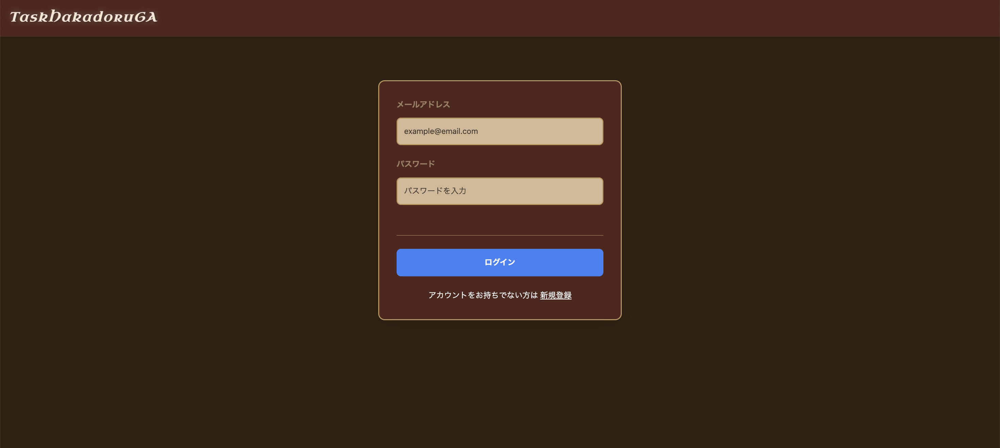
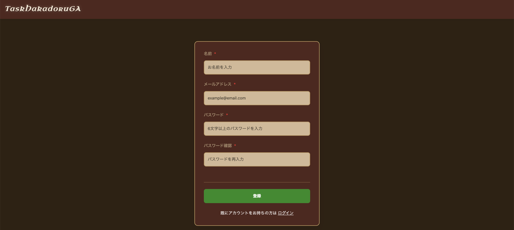
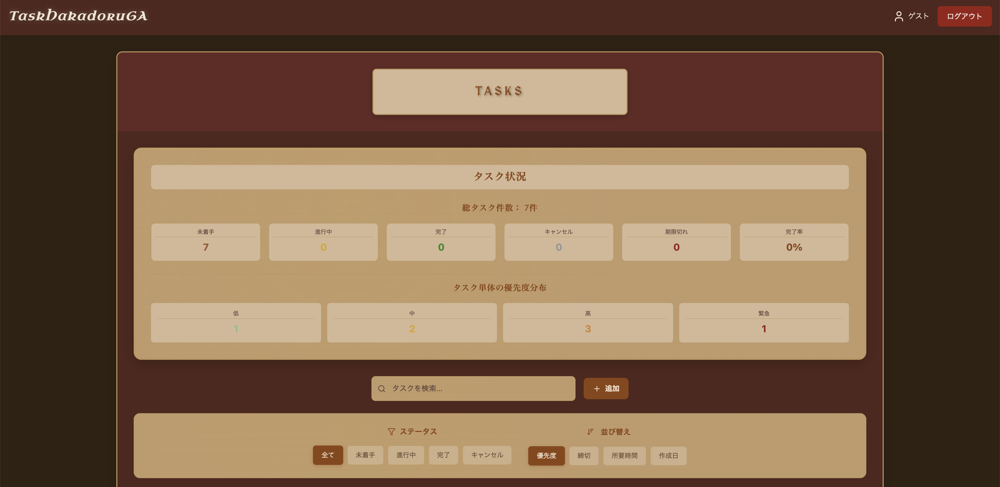

# TaskHakadoruGA

遺伝的アルゴリズム（NSGA-II）による最適タスク優先順位提案アプリ

## 目次

- [システムの概要](#システムの概要)
- [画面例](#画面例)
- [機能説明](#機能説明)
- [アーキテクチャ](#アーキテクチャ)
- [技術スタック](#技術スタック)
- [ディレクトリ構成](#ディレクトリ構成)
- [データベース・テーブル構成](#データベーステーブル構成)
- [NSGA-II 技術説明](#nsga-ii-技術説明)
- [起動手順（@開発環境）](#dev-start)
- [本番環境デプロイメント](#production-deployment)
- [API 仕様](#api-仕様)
- [開発・テスト](#開発テスト)

## システムの概要

TaskHakadoruGA は、多目的遺伝的アルゴリズム（NSGA-II）を活用してタスクの最適な実行順序を提案する Web アプリケーションです。ユーザーが登録したタスクの重要度、緊急度、難易度、所要時間、必要エネルギーなどの属性を総合的に評価し、効率的なタスク実行順序を提案します。

### 主な特徴

- **多目的最適化**: 優先度、効率性、制約違反の 3 つの目的関数を同時に最適化
- **ユーザー認証**: JWT 認証による安全なユーザー管理
- **リアルタイム最適化**: FastAPI による高速な最適化処理
- **直感的 UI**: Next.js + Tailwind CSS によるモダンなユーザーインターフェース
- **マイクロサービス構成**: Rails、FastAPI、Next.js の分離されたアーキテクチャ

### URL

- https://taskhakadoruga.reokambara.com

  ※ 以下でログインして試すことができます。

  - メールアドレス: guest@example.com
  - パスワード: Password0

## 画面例

### ログイン・ユーザー登録画面

<div style="display: flex; gap: 4px">
  
  
</div>

### 一覧画面

<div style="display: flex; gap: 4px">
  
  
</div>

### タスク追加モーダル画面

<p align="left">
  
</p>

## デモ GIF

- 最良解のみ提示
<p align="left">
  
</p>

- 複数解を提示
<p align="left">
  
</p>

## 機能説明

### 認証機能

- **ユーザー登録**: 新規アカウント作成
- **ログイン/ログアウト**: JWT 認証によるセッション管理
- **認証状態管理**: React Context による認証状態の管理

### タスク管理機能

- **タスク作成**: タイトル、説明、重要度、緊急度、難易度、所要時間、必要エネルギーの設定
- **タスク編集**: 既存タスクの属性変更
- **タスク削除**: 不要なタスクの削除
- **ステータス管理**: todo、進行中、完了、キャンセルの 4 つのステータス
- **依存関係設定**: タスク間の依存関係の定義
- **締切設定**: タスクの締切日時の設定

### 最適化機能

- **NSGA-II 最適化**: 多目的遺伝的アルゴリズムによる最適化
- **重み調整**: ユーザーによる目的関数の重み設定
- **複数解提示**: パレート最適解の上位 10 解を提示
- **制約考慮**: 依存関係と締切制約を考慮した最適化

### UI/UX 機能

- **検索・フィルタリング**: タスクの検索とステータス別フィルタリング
- **ソート機能**: 優先度、締切、所要時間、作成日時でのソート
- **選択モード**: 複数タスクの一括選択と最適化
- **レスポンシブデザイン**: モバイル・デスクトップ対応
- **トースト通知**: 操作結果のリアルタイム通知

## アーキテクチャ

```text
┌─────────────────┐    ┌─────────────────┐    ┌─────────────────┐
│   Frontend      │    │    Backend      │    │   Optimizer     │
│   (Next.js)     │◄──►│    (Rails)      │◄──►│   (FastAPI)     │
│   Port: 3001    │    │   Port: 3000    │    │   Port: 8000    │
└─────────────────┘    └─────────────────┘    └─────────────────┘
         │                       │                       │
         │                       │                       │
         └───────────────────────┼───────────────────────┘
                                 │
                    ┌─────────────────┐
                    │     MySQL       │
                    │   Port: 3306    │
                    └─────────────────┘
```

### サービス間通信

- **Frontend ↔ Backend**: REST API（JWT 認証）
- **Backend ↔ Optimizer**: HTTP API（JSON 通信）
- **Backend ↔ Database**: ActiveRecord ORM
- **All Services ↔ Database**: MySQL 接続

## 技術スタック

### フロントエンド

- **Next.js 15.3.5**: React フレームワーク
- **React 19.0.0**: UI ライブラリ
- **TypeScript 5**: 型安全な開発
- **Tailwind CSS 3.4.17**: ユーティリティファースト CSS
- **React Hot Toast**: 通知システム
- **Lucide React**: アイコンライブラリ

### バックエンド

- **Ruby on Rails 8.0**: Web アプリケーションフレームワーク
- **Ruby 3.3**: プログラミング言語
- **MySQL 8.0**: リレーショナルデータベース
- **JWT**: 認証トークン
- **BCrypt**: パスワードハッシュ化

### 最適化エンジン

- **FastAPI**: 高性能 WebAPI フレームワーク
- **Python 3.11**: プログラミング言語
- **PyMOO**: 多目的最適化ライブラリ
- **NumPy**: 数値計算ライブラリ
- **NSGA-II**: 多目的遺伝的アルゴリズム

### インフラ・開発環境

- **Docker & Docker Compose**: コンテナ化・開発環境
- **Kubernetes**: 本番環境オーケストレーション
- **MySQL 8.0**: データベース
- **Traefik**: Ingress Controller・ロードバランサー
- **cert-manager**: SSL 証明書自動管理
- **RSpec**: Rails テストフレームワーク
- **ESLint**: JavaScript リンター

## ディレクトリ構成

```text
TaskHakadoruGA/
├── backend/                 # Rails API サーバー
│   ├── app/
│   │   ├── controllers/     # APIコントローラー
│   │   │   ├── api/v1/     # API v1エンドポイント
│   │   │   └── auth_controller.rb  # 認証コントローラー
│   │   ├── models/         # データモデル
│   │   │   ├── user.rb     # ユーザーモデル
│   │   │   └── task.rb     # タスクモデル
│   │   └── services/       # ビジネスロジック
│   │       ├── authenticate_user.rb
│   │       ├── authorize_api_request.rb
│   │       └── json_web_token.rb
│   ├── config/             # Rails設定
│   ├── db/                 # データベース関連
│   │   ├── migrate/        # マイグレーションファイル
│   │   └── schema.rb       # データベーススキーマ
│   └── spec/               # テストファイル
├── frontend/               # Next.js フロントエンド
│   ├── src/
│   │   ├── app/            # App Router
│   │   ├── components/     # Reactコンポーネント
│   │   │   ├── auth/       # 認証関連コンポーネント
│   │   │   ├── TaskList.tsx
│   │   │   ├── TaskCard.tsx
│   │   │   └── OptimizationButton.tsx
│   │   ├── contexts/       # React Context
│   │   ├── hooks/          # カスタムフック
│   │   ├── lib/            # ユーティリティ
│   │   └── types/          # TypeScript型定義
│   └── public/             # 静的ファイル
├── optimizer/              # FastAPI 最適化サーバー
│   ├── main.py             # FastAPIアプリケーション
│   ├── optimizer.py        # NSGA-II最適化ロジック
│   └── requirements.txt    # Python依存関係
├── k8s/                    # Kubernetesマニフェスト
│   ├── namespace.yaml      # 名前空間定義
│   ├── backend/            # バックエンド関連リソース
│   ├── frontend/           # フロントエンド関連リソース
│   ├── optimizer/          # 最適化エンジン関連リソース
│   ├── database/           # データベース関連リソース
│   └── ingress.yaml        # Ingress設定
├── deploy.sh               # 本番デプロイスクリプト
├── undeploy.sh             # アンデプロイスクリプト
├── docker-compose.yml      # Docker構成（開発環境）
├── .env                    # 環境変数
└── README.md              # このファイル
```

## データベース・テーブル構成

### users テーブル

| カラム名        | 型           | 制約               | 説明                 |
| --------------- | ------------ | ------------------ | -------------------- |
| id              | bigint       | PK, AUTO_INCREMENT | ユーザー ID          |
| name            | varchar(255) | NOT NULL           | ユーザー名           |
| email           | varchar(255) | NOT NULL, UNIQUE   | メールアドレス       |
| password_digest | varchar(255) | NOT NULL           | ハッシュ化パスワード |
| created_at      | datetime     | NOT NULL           | 作成日時             |
| updated_at      | datetime     | NOT NULL           | 更新日時             |

### tasks テーブル

| カラム名        | 型           | 制約               | 説明                   |
| --------------- | ------------ | ------------------ | ---------------------- |
| id              | bigint       | PK, AUTO_INCREMENT | タスク ID              |
| user_id         | bigint       | NOT NULL, FK       | ユーザー ID            |
| title           | varchar(255) | NOT NULL           | タスクタイトル         |
| description     | text         | NULL               | タスク説明             |
| deadline        | datetime     | NULL               | 締切日時               |
| duration        | int          | NOT NULL           | 所要時間（分）         |
| energy_required | int          | DEFAULT 5          | 必要エネルギー（1-10） |
| importance      | int          | DEFAULT 3          | 重要度（1-5）          |
| urgency         | int          | DEFAULT 3          | 緊急度（1-5）          |
| ease            | int          | DEFAULT 3          | 難易度（1-5）          |
| status          | varchar(255) | DEFAULT 'todo'     | ステータス             |
| dependencies    | text         | NULL               | 依存関係（JSON）       |
| created_at      | datetime     | NOT NULL           | 作成日時               |
| updated_at      | datetime     | NOT NULL           | 更新日時               |

### インデックス

- `index_users_on_email` (UNIQUE)
- `index_tasks_on_user_id`
- `index_tasks_on_deadline`
- `index_tasks_on_status`

## NSGA-II 技術説明

### アルゴリズム概要

**NSGA-II（Non-dominated Sorting Genetic Algorithm II）** は、複数の相反する目的を同時に最適化する多目的最適化問題のための最先端の進化的アルゴリズムです。本システムでは、タスクスケジューリングという複雑な問題を、**3 つの目的関数を同時に最適化**することで解決しています。

#### なぜ NSGA-II を選択したのか

1. **多目的最適化の必要性**: タスクの優先順位付けは単一の基準では決められない
2. **パレート最適解の提供**: 複数の最適解を提示し、ユーザーが選択可能
3. **制約条件の考慮**: 依存関係や締切などの現実的な制約を組み込み可能
4. **スケーラビリティ**: タスク数の増加に対して効率的に動作

### 目的関数の詳細設計

本システムでは、以下の 3 つの目的関数を**同時に最適化**します：

#### 1. 優先度最大化 (Priority Maximization)

```python
def _calculate_priority_objective(self, ordered_tasks: List[Dict]) -> float:
    total_score = 0.0
    for position, task in enumerate(ordered_tasks):
        # 基本優先度スコア
        priority_score = (
            task['importance'] * self.weights.get('importance', 3.0) +
            task['urgency'] * self.weights.get('urgency', 2.0) +
            (6 - task['ease']) * self.weights.get('ease', 1.0)
        )
        # 位置によるペナルティ（後ろほど大きなペナルティ）
        position_penalty = 1.0 / (position + 1)
        total_score += priority_score * position_penalty
    return total_score
```

**特徴:**

- **重要度・緊急度重視**: ユーザーが設定した重要度と緊急度を重み付けで評価
- **難易度考慮**: 簡単なタスクを優先的に配置（Quick Win 戦略）
- **位置ペナルティ**: 重要なタスクが後回しになることを防ぐ

#### 2. 効率性最大化 (Efficiency Maximization)

```python
def _calculate_efficiency_objective(self, ordered_tasks: List[Dict]) -> float:
    total_efficiency = 0.0
    for position, task in enumerate(ordered_tasks):
        # エネルギー効率（必要エネルギーが少ないほど良い）
        energy_efficiency = (11 - task['energy_required']) / 10.0
        # 時間効率（短時間で完了できるタスクを優先）
        time_efficiency = 1.0 / (task['duration'] / 60.0 + 1)
        # 容易さによる効率性
        ease_efficiency = task['ease'] / 5.0

        efficiency_score = (
            energy_efficiency * self.weights.get('energy', 2.0) +
            time_efficiency * self.weights.get('time', 1.5) +
            ease_efficiency * self.weights.get('ease', 1.0)
        )
        position_weight = 1.0 / (position + 1)
        total_efficiency += efficiency_score * position_weight
    return total_efficiency
```

**特徴:**

- **エネルギー効率**: 疲労度を考慮した最適な順序
- **時間効率**: 短時間タスクの優先配置
- **実行容易性**: 簡単なタスクから始めるモチベーション維持

#### 3. 制約違反最小化 (Constraint Violation Minimization)

```python
def _calculate_constraint_violation(self, ordered_tasks: List[Dict], order_array: np.ndarray) -> float:
    violation_score = 0.0

    # 依存関係制約の確認
    task_positions = {task['id']: position for position, task in enumerate(ordered_tasks)}
    for position, task in enumerate(ordered_tasks):
        if task['dependencies']:
            for dep_id in task['dependencies']:
                if dep_id in task_positions:
                    dep_position = task_positions[dep_id]
                    if dep_position > position:
                        violation_score += 10.0  # 依存関係違反

    # 締切制約の確認
    current_time = datetime.now()
    for task in ordered_tasks:
        current_time += timedelta(minutes=task['duration'])
        if task['deadline']:
            deadline = datetime.fromisoformat(task['deadline'].replace('Z', '+00:00'))
            if current_time > deadline:
                delay_hours = (current_time - deadline).total_seconds() / 3600
                violation_score += min(delay_hours * 2.0, 20.0)

    return violation_score
```

**特徴:**

- **依存関係制約**: タスクの前提条件を厳密に管理
- **締切制約**: 遅延時間に応じた動的ペナルティ
- **現実的制約**: 実際のプロジェクト管理で必要な制約を考慮

### アルゴリズムパラメータの動的調整

```python
# タスク数に応じた動的パラメータ調整
pop_size = min(50, len(request.tasks) * 10)
n_gen = min(100, 50 + len(request.tasks) * 5)

# NSGA-IIの設定
algorithm = NSGA2(
    pop_size=pop_size,
    crossover=SBX(prob=0.9, eta=15),      # Simulated Binary Crossover
    mutation=PM(prob=1.0/n_var, eta=20),  # Polynomial Mutation
    selection=TournamentSelection(pressure=2)
)
```

**特徴:**

- **適応的集団サイズ**: タスク数に応じて最適な集団サイズを自動調整
- **世代数の最適化**: 問題の複雑さに応じた収束世代数の設定
- **高性能な遺伝的操作**: 実数値最適化に特化した SBX と PM

### 最適化プロセスの詳細

#### 1. 初期集団生成と評価

```python
# 連続値配列（0-1）をランキングベースで順列に変換
def _evaluate(self, x, out, *args, **kwargs):
    indices = np.argsort(x)  # xの値でソートしたインデックス
    ordered_tasks = [self.tasks[i] for i in indices]

    f1 = self._calculate_priority_objective(ordered_tasks)
    f2 = self._calculate_efficiency_objective(ordered_tasks)
    f3 = self._calculate_constraint_violation(ordered_tasks, indices)

    # 最小化問題として定式化
    out["F"] = [-f1, -f2, f3]  # 優先度と効率性は最大化、制約違反は最小化
```

#### 2. 非支配ソートとパレート最適性

- **フロント分類**: 解を支配関係に基づいて階層化
- **クラウディング距離**: 同一フロント内での多様性維持
- **エリート保存**: 最良解の確実な継承

#### 3. 重み設定のカスタマイズ

```python
# ユーザーカスタマイズ可能な重み設定
class OptimizationWeights(BaseModel):
    importance: float = 3.0   # 重要度の重み
    urgency: float = 2.0      # 緊急度の重み
    ease: float = 1.0         # 容易さの重み
    energy: float = 2.0       # エネルギー効率の重み
    time: float = 1.5         # 時間効率の重み
```

### パレート最適解の活用

#### 複数解の提示

```python
# 上位10解をユーザーに提示
solutions.sort(key=lambda x: x["objectives"]["total_score"], reverse=True)
return {
    "solutions": solutions[:10],
    "best_solution": solutions[0] if solutions else None,
    "total_solutions": len(solutions)
}
```

#### 解の多様性

- **トレードオフの可視化**: 各目的関数間の関係を明示
- **選択肢の提供**: ユーザーの状況に応じた最適解の選択
- **意思決定支援**: 数値的根拠に基づく判断材料の提供

### 実装上の技術的工夫

#### 1. 数値安定性の確保

```python
def convert_numpy_types(obj):
    """numpy型をPythonネイティブ型に変換"""
    if hasattr(obj, 'item'):
        return obj.item()
    elif isinstance(obj, dict):
        return {k: convert_numpy_types(v) for k, v in obj.items()}
    # ...
```

#### 2. エラーハンドリングとフォールバック

```python
try:
    # NSGA-II最適化実行
    result = minimize(problem, algorithm, ('n_gen', n_gen), seed=42)
except Exception as e:
    # フォールバック: 単純な優先度ソート
    sorted_tasks = sorted(tasks, key=lambda x: priority_score(x), reverse=True)
```

#### 3. パフォーマンス最適化

- **並列処理**: 個体評価の並列化
- **メモリ効率**: 大規模問題への対応
- **実行時間制限**: リアルタイム応答の保証

### システムの優位性

1. **科学的根拠**: 査読付き論文で実証された最先端アルゴリズム
2. **実用性**: 現実のタスク管理で必要な全ての要素を考慮
3. **柔軟性**: ユーザーの価値観に応じたカスタマイズ
4. **スケーラビリティ**: 小規模から大規模まで対応
5. **透明性**: 最適化プロセスと結果の完全な可視化

NSGA-II 実装により、単純な優先度付けでは困難な、**複数の相反する目的を同時に考慮した最適なタスク優先順位**を提供します。

## 起動手順（@開発環境）<a id="dev-start"></a>

### 前提条件

- Docker & Docker Compose がインストールされていること
- Git がインストールされていること

### 1. リポジトリのクローン

```bash
git clone <repository-url>
cd TaskHakadoruGA
```

### 2. 環境変数の設定

`.env` ファイルで以下の項目を適切に設定します。

```bash
# Rails
RAILS_PORT=
DATABASE_URL=

# FastAPI
OPTIMIZER_PORT=
OPTIMIZER_DB_URL=
PYTHON_ENV=

# Next.js
NEXTJS_PORT=
NEXT_PUBLIC_API_URL=
NEXT_PUBLIC_OPTIMIZER_URL=

# MySQL
MYSQL_ROOT_PASSWORD=
MYSQL_DB=
MYSQL_USER=
MYSQL_PASSWORD=
```

### 3. Docker コンテナの起動

```bash
# 全サービスをバックグラウンドで起動
docker-compose up -d

# ログを確認する場合
docker-compose up
```

### 4. データベースの初期化

```bash
# Railsコンテナに接続
docker-compose exec backend bash

# データベースの作成とマイグレーション
bundle exec rails db:create
bundle exec rails db:migrate

# シードデータの投入
bundle exec rails db:seed
```

### 5. アプリケーションへのアクセス

- **フロントエンド**: localhost:[NEXTJS_PORT]
- **Rails API**: localhost:[RAILS_PORT]
- **FastAPI 最適化エンジン**: localhost:[OPTIMIZER_PORT]

### 6. 開発用コマンド

#### ログの確認

```bash
# 全サービスのログ
docker-compose logs -f

# 特定サービスのログ
docker-compose logs -f frontend
docker-compose logs -f backend
docker-compose logs -f optimizer
```

#### コンテナの停止・再起動

```bash
# 停止
docker-compose down

# 再起動
docker-compose restart

# 完全なクリーンアップ
docker-compose down -v
docker-compose up --build
```

#### データベースのリセット

```bash
docker-compose exec backend bash
bundle exec rails db:drop db:create db:migrate
```

## 本番環境デプロイメント<a id="production-deployment"></a>

### Kubernetes クラスターへのデプロイ

本アプリケーションは Kubernetes クラスターでの本番運用に対応しています。

#### 前提条件

- Kubernetes クラスター（k3s、EKS、GKE 等）
- kubectl コマンドラインツール
- Docker Hub または他のコンテナレジストリへのアクセス
- SSL 証明書管理（cert-manager 推奨）

#### デプロイ手順

1. **シークレットファイルの作成**

```bash
# バックエンド用のシークレット設定
cp k8s/backend/secret.yaml.example k8s/backend/secret.yaml
# 適切な値を設定してください
```

2. **イメージのビルドとプッシュ**

```bash
# 自動デプロイスクリプトを使用
./deploy.sh

# または手動でビルド・プッシュ
docker build --platform linux/amd64 -t your-registry/task-hakadoru-ga-backend:latest ./backend
docker build --platform linux/amd64 -t your-registry/task-hakadoru-ga-frontend:latest ./frontend
docker build --platform linux/amd64 -t your-registry/task-hakadoru-ga-optimizer:latest ./optimizer

docker push your-registry/task-hakadoru-ga-backend:latest
docker push your-registry/task-hakadoru-ga-frontend:latest
docker push your-registry/task-hakadoru-ga-optimizer:latest
```

3. **Kubernetes リソースのデプロイ**

```bash
# 名前空間の作成
kubectl apply -f k8s/namespace.yaml

# シークレットとConfigMapの適用
kubectl apply -f k8s/backend/secret.yaml
kubectl apply -f k8s/backend/configmap.yaml

# データベースのデプロイ
kubectl apply -f k8s/database/

# アプリケーションのデプロイ
kubectl apply -f k8s/backend/
kubectl apply -f k8s/frontend/
kubectl apply -f k8s/optimizer/

# Ingressの設定
kubectl apply -f k8s/ingress.yaml
```

#### 本番環境の構成

```text
┌─────────────────┐    ┌─────────────────┐
│   Ingress       │    │   SSL/TLS       │
│   (Traefik)     │◄──►│  (cert-manager) │
└─────────────────┘    └─────────────────┘
         │
         ▼
┌─────────────────┐    ┌─────────────────┐    ┌─────────────────┐
│   Frontend      │    │    Backend      │    │   Optimizer     │
│   (Next.js)     │◄──►│    (Rails)      │◄──►│   (FastAPI)     │
│   Deployment    │    │   Deployment    │    │   Deployment    │
│   ClusterIP     │    │   ClusterIP     │    │   ClusterIP     │
└─────────────────┘    └─────────────────┘    └─────────────────┘
         │                       │                       │
         └───────────────────────┼───────────────────────┘
                                 │
                    ┌─────────────────┐
                    │     MySQL       │
                    │   Deployment    │
                    │   ClusterIP     │
                    │   + PVC         │
                    └─────────────────┘
```

#### 運用管理コマンド

```bash
# デプロイメント状況の確認
kubectl get pods,svc,ingress -n task-hakadoru-ga

# ログの確認
kubectl logs -f deployment/backend -n task-hakadoru-ga
kubectl logs -f deployment/frontend -n task-hakadoru-ga
kubectl logs -f deployment/optimizer -n task-hakadoru-ga

# スケーリング
kubectl scale deployment backend --replicas=3 -n task-hakadoru-ga

# ローリングアップデート
kubectl rollout restart deployment/backend -n task-hakadoru-ga

# アンデプロイ
./undeploy.sh
```

## API 仕様

### 認証 API

- `POST /auth/register` - ユーザー登録
- `POST /auth/login` - ログイン
- `GET /auth/me` - ユーザー情報取得

### タスク API

- `GET /api/v1/tasks` - タスク一覧取得
- `POST /api/v1/tasks` - タスク作成
- `GET /api/v1/tasks/:id` - タスク詳細取得
- `PUT /api/v1/tasks/:id` - タスク更新
- `DELETE /api/v1/tasks/:id` - タスク削除

### 最適化 API

- `POST /optimizer/optimize` - タスク最適化実行
- `GET /health` - ヘルスチェック

## 開発・テスト

### バックエンドのテスト

```bash
docker-compose exec backend bash
bundle exec rspec
```

### フロントエンドの開発

```bash
docker-compose exec frontend bash
npm run dev
npm run lint
```

### 最適化エンジンのテスト

```bash
docker-compose exec optimizer bash
python test_api.py
```

## 備考

- ローカル開発環境: Docker Compose を使用
- 本番環境: Kubernetes クラスターで運用
